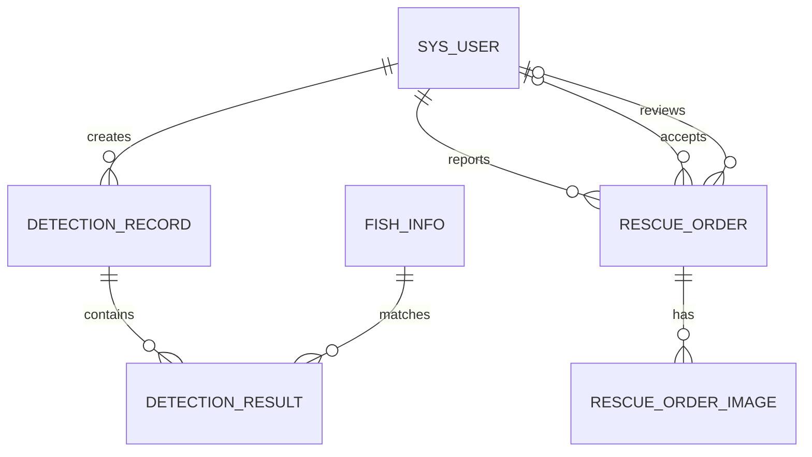

# 海洋鱼类智能化信息管理系统数据库设计

## 1. 设计原则

1. 表名和字段名使用小写下划线命名。
2. 每张核心业务表使用独立主键 `id`。
3. 表之间通过外键字段保存关联对象的主键，例如 `user_id` 保存用户表中的 `id`。
4. 图片和视频保存在文件存储中，数据库只保存访问地址和文件元数据。
5. 创建时间表示记录何时产生，更新时间表示最后一次修改时间。
6. 需要保留历史数据的表优先采用逻辑删除。
7. 一对多的数据不强行塞进一个字段，必要时拆分子表。

## 2. 主键与外键

主键用于唯一标识本表的一条记录。外键用于表达两张表之间的关系。

例如：

```text
sys_user
id = 10
username = user_a

detection_record
id = 101
user_id = 10
```

`detection_record.id` 是识别记录自己的主键，`detection_record.user_id` 指向用户 `10`。不能使用识别记录自己的 `id` 来判断所属用户，因为两个 `id` 分别属于不同的编号体系。

## 3. 核心实体关系



符号含义：

- 一个用户可以创建多条识别记录。
- 一张图片可以识别出零个、一个或多个目标，因此一条识别记录可以包含多条识别结果。
- 一个用户可以上报多个工单。
- 一个工单在未接单时没有志愿者，接单后关联一名志愿者。
- 一个工单可以包含多张现场图片。

## 4. 用户表 `sys_user`

用户表保存账号、个人资料和账号状态。其他表统一通过 `user_id`、`reporter_id`、`volunteer_id` 和 `reviewer_id` 引用它的主键 `id`。

| 字段 | 建议类型 | 是否为空 | 含义 |
| --- | --- | --- | --- |
| id | BIGINT | 否 | 主键 |
| username | VARCHAR(50) | 否 | 唯一登录账号 |
| password_hash | VARCHAR(255) | 否 | 密码散列值，禁止保存明文 |
| nickname | VARCHAR(100) | 是 | 页面显示名称 |
| email | VARCHAR(255) | 是 | 唯一邮箱 |
| phone | VARCHAR(30) | 是 | 唯一手机号 |
| avatar_url | VARCHAR(500) | 是 | 头像文件地址 |
| status | VARCHAR(30) | 否 | ACTIVE、DISABLED 或 LOCKED |
| created_at | DATETIME | 否 | 创建时间 |
| updated_at | DATETIME | 否 | 更新时间 |
| deleted | TINYINT | 否 | 逻辑删除标记 |

邮箱和手机号允许为空。MySQL 唯一索引允许存在多条 `NULL`，但不允许两个用户保存相同的非空邮箱或手机号。

首版建表脚本位于 [`database/migrations/V002__create_sys_user.sql`](../database/migrations/V002__create_sys_user.sql)。

## 5. 鱼类信息表 `fish_info`

| 字段 | 建议类型 | 是否为空 | 含义 |
| --- | --- | --- | --- |
| id | BIGINT | 否 | 主键 |
| chinese_name | VARCHAR(100) | 否 | 中文名称 |
| scientific_name | VARCHAR(150) | 是 | 学名 |
| category | VARCHAR(100) | 是 | 鱼类类别 |
| appearance | TEXT | 是 | 外观特征 |
| habits | TEXT | 是 | 生活习性 |
| habitat | TEXT | 是 | 栖息环境 |
| distribution | TEXT | 是 | 分布区域 |
| protection_level | VARCHAR(50) | 是 | 保护级别 |
| cover_image_url | VARCHAR(500) | 是 | 封面图片地址 |
| source_type | VARCHAR(30) | 否 | 数据来源类型，如 OFFICIAL、USER |
| source_description | VARCHAR(500) | 是 | 来源说明或参考资料 |
| created_by | BIGINT | 是 | 创建该资料的用户或管理员 |
| created_at | DATETIME | 否 | 创建时间 |
| updated_at | DATETIME | 否 | 更新时间 |
| deleted | TINYINT | 否 | 逻辑删除标记，0 正常、1 删除 |

保护信息不建议只用“是否珍稀”的布尔值。保护级别可能存在“无保护级别、国家一级、国家二级、IUCN 等级”等多种情况，使用 `protection_level` 更容易扩展。

首版建表脚本位于 [`database/migrations/V001__create_fish_info.sql`](../database/migrations/V001__create_fish_info.sql)。

鱼类中文名可能存在别名、俗名或同名情况，首版只为它建立普通索引，不设置唯一约束。学名更适合作为物种的唯一业务标识，因此为非空学名设置唯一索引。后续如果需要管理多个别名，应建立独立的鱼类别名表。

## 6. 用户与角色关系

用户和角色是多对多关系：

- 一个用户可以同时拥有 `USER` 和 `VOLUNTEER` 等多个角色。
- 一个角色可以授予多个用户。
- `sys_user_role` 是连接用户和角色的关联表。

`sys_user_role.user_id` 引用 `sys_user.id`，表示角色属于哪个用户；`sys_user_role.role_id` 引用 `sys_role.id`，表示授予的是哪个角色。

联合唯一约束 `UNIQUE (user_id, role_id)` 防止同一个用户被重复授予相同角色。例如已有 `(10, 2)` 后，数据库会拒绝再次插入 `(10, 2)`。

`assigned_by` 记录角色授予人。用户注册时系统自动授予 `USER`，此时允许为空；管理员审核志愿者申请后授予 `VOLUNTEER`，此时保存管理员的用户编号。

首版建表脚本位于 [`database/migrations/V003__create_role_tables.sql`](../database/migrations/V003__create_role_tables.sql)。

## 7. 识别记录表 `detection_record`

这张表表示用户发起的一次识别任务。

| 字段 | 建议类型 | 是否为空 | 含义 |
| --- | --- | --- | --- |
| id | BIGINT | 否 | 主键 |
| user_id | BIGINT | 否 | 发起识别的用户编号 |
| original_image_url | VARCHAR(500) | 否 | 原始图片地址 |
| result_image_url | VARCHAR(500) | 是 | 标注结果图片地址 |
| model_name | VARCHAR(100) | 否 | 使用的模型名称或版本 |
| confidence_threshold | DECIMAL(5,4) | 否 | 用户选择的置信度阈值 |
| status | VARCHAR(30) | 否 | PROCESSING、SUCCESS、NO_TARGET、FAILED |
| error_code | VARCHAR(50) | 是 | 失败类型编码 |
| error_message | VARCHAR(500) | 是 | 对用户可理解的失败原因 |
| started_at | DATETIME | 否 | 开始识别时间 |
| completed_at | DATETIME | 是 | 完成时间 |
| duration_ms | BIGINT | 是 | 识别耗时，单位毫秒 |
| created_at | DATETIME | 否 | 记录创建时间 |

“识别结果”不建议只写入一个模糊的文本字段，因为一张图片可能同时识别出多条鱼，需要单独建立结果明细表。

## 8. 识别结果表 `detection_result`

| 字段 | 建议类型 | 是否为空 | 含义 |
| --- | --- | --- | --- |
| id | BIGINT | 否 | 主键 |
| record_id | BIGINT | 否 | 所属识别记录 |
| fish_id | BIGINT | 是 | 匹配的鱼类资料；资料未收录时为空 |
| class_name | VARCHAR(100) | 否 | YOLO 返回的类别名称 |
| confidence | DECIMAL(5,4) | 否 | 置信度 |
| box_x1 | DECIMAL(10,4) | 否 | 目标框左上角横坐标 |
| box_y1 | DECIMAL(10,4) | 否 | 目标框左上角纵坐标 |
| box_x2 | DECIMAL(10,4) | 否 | 目标框右下角横坐标 |
| box_y2 | DECIMAL(10,4) | 否 | 目标框右下角纵坐标 |
| created_at | DATETIME | 否 | 创建时间 |

当 `fish_id` 为空但 `class_name` 存在时，表示模型识别出了已知类别，但业务鱼类资料尚未配置，系统可以据此生成资料补全任务。

## 9. 救助工单表 `rescue_order`

| 字段 | 建议类型 | 是否为空 | 含义 |
| --- | --- | --- | --- |
| id | BIGINT | 否 | 主键 |
| order_no | VARCHAR(40) | 否 | 对用户展示的唯一工单编号 |
| event_type | VARCHAR(30) | 否 | ENVIRONMENT 或 ANIMAL_RESCUE |
| title | VARCHAR(200) | 否 | 工单标题 |
| description | TEXT | 否 | 问题描述 |
| location_text | VARCHAR(500) | 是 | 手动填写的文字地址 |
| longitude | DECIMAL(10,7) | 是 | 浏览器定位经度 |
| latitude | DECIMAL(10,7) | 是 | 浏览器定位纬度 |
| contact_name | VARCHAR(100) | 否 | 联系人 |
| contact_phone | VARCHAR(30) | 否 | 联系电话 |
| status | VARCHAR(30) | 否 | 当前工单状态 |
| reporter_id | BIGINT | 否 | 上报用户 |
| volunteer_id | BIGINT | 是 | 接单志愿者，未接单时为空 |
| reviewer_id | BIGINT | 是 | 当前或最近一次审核管理员 |
| review_reason | VARCHAR(500) | 是 | 审核意见或驳回原因 |
| accepted_at | DATETIME | 是 | 志愿者接单时间 |
| feedback_text | TEXT | 是 | 志愿者处理反馈 |
| feedback_at | DATETIME | 是 | 反馈提交时间 |
| completed_at | DATETIME | 是 | 管理员确认完成时间 |
| created_at | DATETIME | 否 | 工单创建时间 |
| updated_at | DATETIME | 否 | 工单更新时间 |
| deleted | TINYINT | 否 | 逻辑删除标记 |

`reporter_id`、`volunteer_id` 和 `reviewer_id` 都引用用户表的 `id`，但承担不同业务角色。志愿者和管理员在相应流程发生前允许为空。

## 10. 工单图片表 `rescue_order_image`

一个工单可能有多张上报图片和多张处理反馈图片，因此使用子表保存。

| 字段 | 建议类型 | 是否为空 | 含义 |
| --- | --- | --- | --- |
| id | BIGINT | 否 | 主键 |
| order_id | BIGINT | 否 | 所属救助工单 |
| image_url | VARCHAR(500) | 否 | 图片访问地址 |
| image_type | VARCHAR(30) | 否 | REPORT 或 FEEDBACK |
| uploaded_by | BIGINT | 否 | 上传用户 |
| created_at | DATETIME | 否 | 上传时间 |

## 11. 图片地址的实现方式

第一版可以采用下面的流程：

```text
用户上传图片
→ Spring Boot 校验图片
→ 生成唯一文件名
→ 保存到服务器 uploads 目录
→ 数据库保存 /files/唯一文件名
→ 前端使用该地址加载图片
```

例如文件实际保存在：

```text
uploads/2026/07/550e8400-e29b-41d4-a716-446655440000.jpg
```

数据库保存：

```text
/files/2026/07/550e8400-e29b-41d4-a716-446655440000.jpg
```

以后迁移到对象存储时，只需要替换文件服务和地址，不需要把图片二进制搬进每一张业务表。

## 12. 时间字段规则

- 核心业务表统一保留 `created_at`。
- 数据可能被修改的表保留 `updated_at`。
- 流程中的关键动作使用独立时间，例如 `accepted_at`、`feedback_at`、`completed_at`。
- 识别记录通常不会被用户修改，因此重点记录开始时间、完成时间和耗时，不必为了形式加入无意义的更新时间。

## 13. 志愿者申请表 `volunteer_application`

志愿者申请表保存申请人提交的信息快照和管理员审核结果。客户端只能提交申请资料，申请状态由后端固定初始化为 `PENDING`，不能信任客户端传入的审核状态。

| 字段 | 建议类型 | 是否为空 | 含义 |
| --- | --- | --- | --- |
| id | BIGINT | 否 | 主键 |
| applicant_id | BIGINT | 否 | 申请用户编号 |
| real_name | VARCHAR(100) | 否 | 申请时填写的真实姓名 |
| phone | VARCHAR(30) | 否 | 申请时填写的联系电话 |
| region | VARCHAR(100) | 否 | 所在地区 |
| skills | VARCHAR(500) | 是 | 擅长领域 |
| reason | TEXT | 否 | 申请理由 |
| status | VARCHAR(20) | 否 | 申请状态 |
| reviewer_id | BIGINT | 是 | 审核管理员编号 |
| review_comment | VARCHAR(500) | 是 | 审核意见 |
| reviewed_at | DATETIME | 是 | 审核时间 |
| created_at | DATETIME | 否 | 创建时间 |
| updated_at | DATETIME | 否 | 更新时间 |

管理员审核通过时必须在同一个数据库事务中：

1. 将申请状态更新为 `APPROVED`，并保存审核人、审核意见和审核时间。
2. 在 `sys_user_role` 中为申请人增加或重新启用 `VOLUNTEER` 角色。

任意一步失败时，事务需要撤销全部修改，避免出现“申请已通过但用户没有志愿者权限”等不一致状态。

首版建表脚本位于 [`database/migrations/V004__create_volunteer_application.sql`](../database/migrations/V004__create_volunteer_application.sql)。

## 14. 后续设计

后续还需要设计鱼类资料申请、识别记录、救助工单、工单状态日志和公开公告等表。完成核心表设计后，将使用 MySQL 8 或 Docker 实际执行全部迁移脚本。
