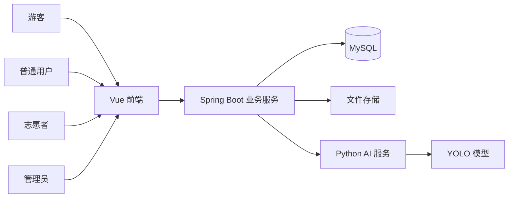
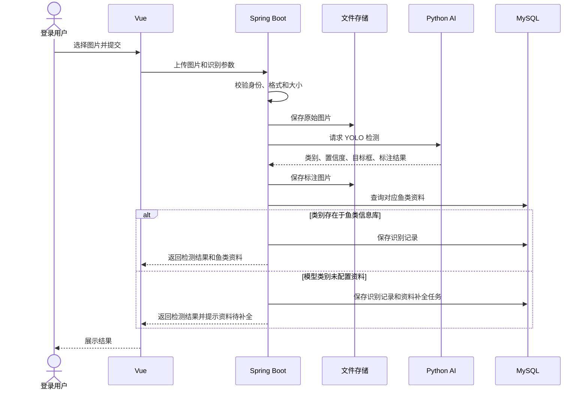
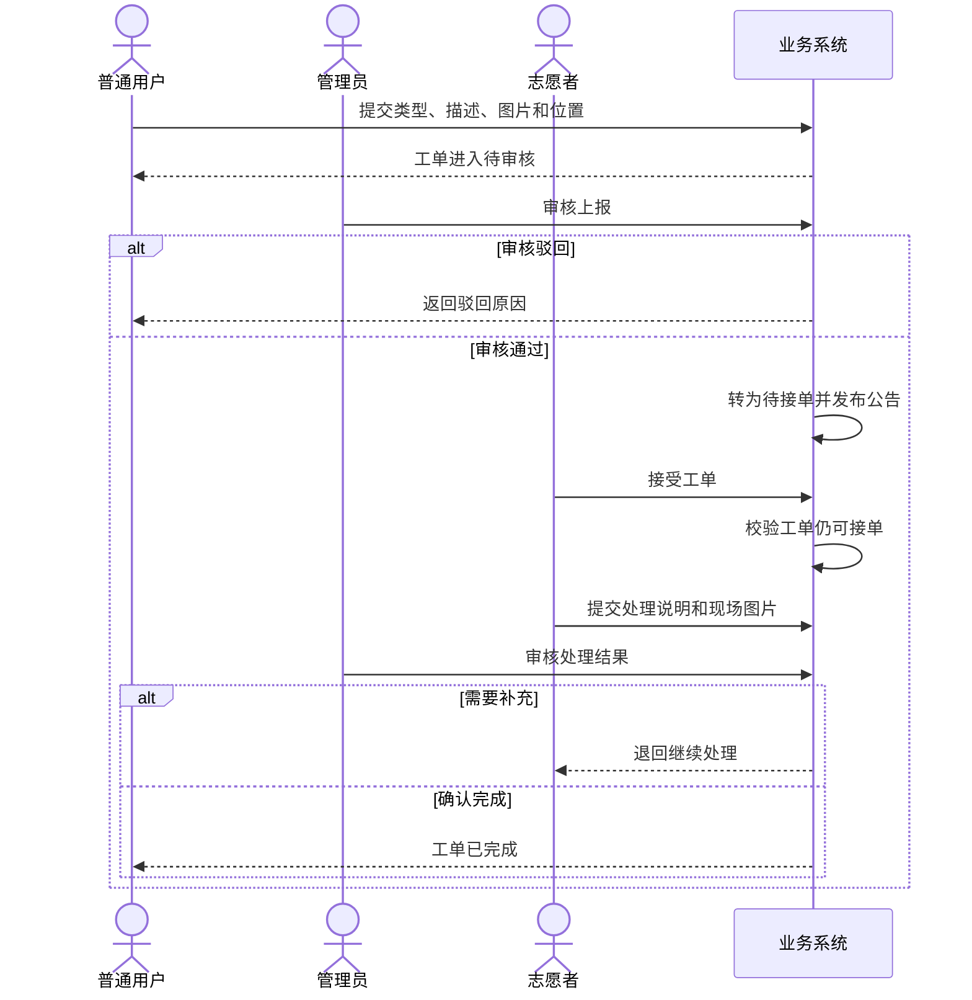

# 海洋鱼类智能化信息管理系统设计

## 1. 设计目标

系统采用前后端分离架构，将业务管理与 AI 推理解耦。Spring Boot 负责身份、权限、业务规则和数据持久化；Python AI 服务只负责模型加载与推理；Vue 负责页面展示和用户交互。

## 2. 系统上下文

## 3. 服务职责

### 3.1 Vue 前端

- 展示公开鱼类资料和救助公告。
- 提供注册、登录、图片上传、资料申请和问题上报页面。
- 根据登录状态和角色显示可用功能。
- 获取浏览器定位；用户拒绝授权时允许手动填写地址。
- 展示接口返回的成功、失败和处理中状态。

### 3.2 Spring Boot 业务服务

- 用户认证和角色权限校验。
- 参数、文件和业务状态校验。
- 鱼类资料、申请、识别记录和工单管理。
- 保存原始文件和结果文件的地址。
- 调用 Python AI 服务并组合鱼类资料。
- 保证一个待接工单只能被一名志愿者成功接单。
- 提供统一响应、异常处理和操作记录。

### 3.3 Python AI 服务

- 启动时加载 YOLO 模型。
- 接收 Spring Boot 提供的图片或可访问的文件地址。
- 执行目标检测。
- 返回类别、置信度、目标框和标注结果。
- 不处理用户权限、工单和鱼类资料维护。

### 3.4 MySQL

- 保存结构化业务数据和文件地址。
- 不直接保存图片、视频和模型等大文件内容。

### 3.5 文件存储

第一版使用服务器本地目录保存文件，数据库保存相对路径或访问地址。部署增强阶段可以替换为对象存储，业务表结构不需要随之大幅改变。

## 4. 角色用例

```mermaid
flowchart TB
    Guest["游客"] --> BrowseFish["浏览、搜索鱼类资料"]
    Guest --> BrowseNotice["浏览公开救助公告"]

    User["普通用户"] --> BrowseFish
    User --> ImageDetect["图片鱼类识别"]
    User --> ViewRecord["查看自己的识别记录"]
    User --> FishApply["提交资料纠错或新增申请"]
    User --> VolunteerApply["申请成为志愿者"]
    User --> RescueReport["上报环境或动物救助问题"]
    User --> ViewOwnOrder["查看自己的上报进度"]

    Volunteer["志愿者"] --> ImageDetect
    Volunteer --> AcceptOrder["接受待接工单"]
    Volunteer --> SubmitFeedback["提交处理反馈"]

    Admin["管理员"] --> FishManage["维护鱼类资料"]
    Admin --> UserManage["管理用户"]
    Admin --> ReviewApply["审核资料和志愿者申请"]
    Admin --> ReviewOrder["审核与调度救助工单"]
    Admin --> ConfirmOrder["确认处理结果"]
    Admin --> Statistics["查看统计数据"]
```

## 5. 图片识别流程

### 5.1 识别结果保存内容

- 用户编号。
- 原始图片地址和标注图片地址。
- 使用的模型版本和置信度阈值。
- 检测类别、置信度和目标框。
- 识别状态、失败类型和失败原因。
- 请求时间、完成时间和耗时。

### 5.2 失败分类

| 类型 | 示例 | 处理方式 |
| --- | --- | --- |
| 输入错误 | 格式不支持、文件损坏、文件过大 | 拒绝请求并提示用户 |
| 未检出目标 | 没有目标或置信度过低 | 提示更换图片，不视为系统故障 |
| AI 服务错误 | 服务不可用、模型加载失败、调用超时 | 记录错误并提示稍后重试 |
| 数据缺失 | 模型类别存在，但鱼类资料未配置 | 返回检测结果并创建资料补全任务 |

## 6. 救助工单流程

## 7. 初步业务模块

| 模块 | 主要职责 |
| --- | --- |
| auth | 注册、登录、令牌和权限 |
| user | 用户资料和状态管理 |
| fish | 鱼类资料维护与查询 |
| application | 资料纠错、新增和志愿者申请 |
| detection | AI 调用、识别结果和记录 |
| file | 文件校验、保存与访问 |
| rescue | 问题上报、公告、接单和反馈 |
| statistics | 识别、用户和工单统计 |

## 8. 关键设计规则

1. 游客是未登录访问者，不是一个需要登录的用户角色。
2. 前端隐藏按钮只改善体验，真正的权限判断必须由后端执行。
3. 数据库保存文件地址，不直接保存图片和视频二进制内容。
4. YOLO 负责检测；鱼类习性、分布和保护级别来自鱼类信息库。
5. “未检测到目标”与“系统调用失败”使用不同状态表达。
6. 工单接单需要并发控制，避免两名志愿者同时接到同一工单。
7. 每次审核和工单状态变化记录操作人、时间和原因。

## 9. 下一步

下一阶段根据本设计识别核心实体、实体关系和数据库表，再确定首个 Spring Boot 迭代的接口范围。

